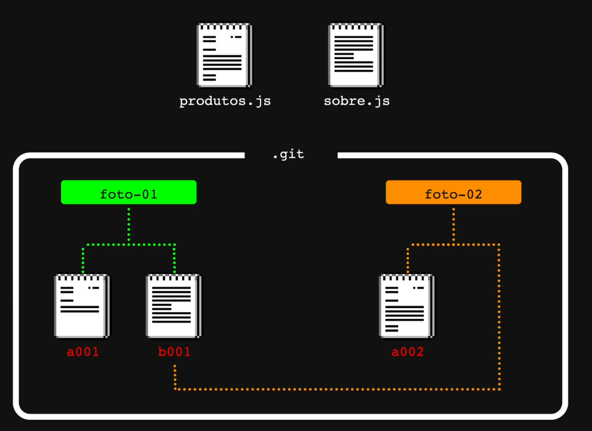

# Como funciona o Git

Sistemas de versionamentos antigo gravavam a forma original dos arquivos, e todos os diffs subsequentes deles. Isso ocupa menos espaço em disco, mas gera um custo computacional gigantesco porque atingir o estado atual de um arquivo exige reconstruí-lo do zero, ou de um ponto significativamente distante no passado.

Mas mais antigo a isso, eram feitas duplicatas completas do projeto todo alterando o nome de forma que tentasse indicar o que havia sido feito naquela versão do código todo duplicado.

O git fica no meio termo: nem salva absolutamente tudo (como esta opção), como também não salva somente todos os diffs (como aquela opção).

A imagem abaixo mostra mais ou menos como funciona o controle do histórico do git:

Onde `foto-01` e `foto-02` são commits, ou seja, alterações feitas ao longo do tempo. Originalmente (`foto-01`) o git salva os arquivos do projeto como `blob`s, quando uma alteração é feita em um arquivo, a versão original dele continua armazenada de forma imutável no histórico do git.

Porém, quando uma alteração é feita (`foto-02`), ele cria um novo blob **do arquivo alterado** com as mudanças que foram feitas, porém os demais arquivos (que não foram alterados) continuam sendo representados pelo blob anterior.

Dessa forma, ao invés de criar um novo blob para o arquivo `sobre.js` (que naõ foi alterado), e acabar com um blob desnecessariamente duplicado, ele apenas aponta para o blob desse arquivo que já existia na versão anterior.